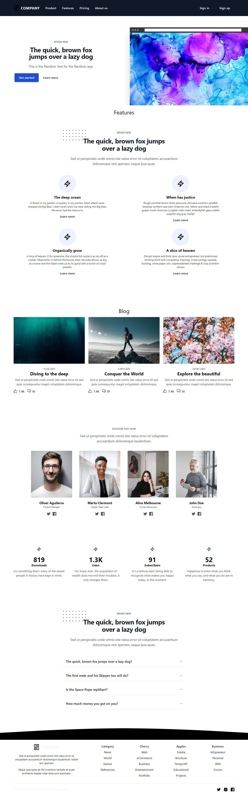

# Agency Website



## Description

This is a modern agency website built using React. It showcases our agency's services, portfolio, and contact information.

## Table of Contents

- [Features](#features)
- [Technologies Used](#technologies-used)
- [Installation](#installation)
- [Usage](#usage)
- [Contributing](#contributing)
- [License](#license)

## Features

- Home Page: An introduction to the agency with a brief overview.
- Services: Details about the services we offer.
- Portfolio: A showcase of our recent projects.
- Contact: Contact information and a contact form for inquiries.
- Responsive Design: Optimized for both desktop and mobile devices.

## Technologies Used

- React
- HTML5 & CSS3
- JavaScript
- [Bootstrap](https://getbootstrap.com/)
- [React Router](https://reactrouter.com/) for routing
- [Axios](https://axios-http.com/) for API requests (if applicable)
- [FontAwesome](https://fontawesome.com/) for icons

## Installation

1. Clone the repository:

```bash
https://github.com/Abdull-Haseeb/Agency-website-with-React
```
